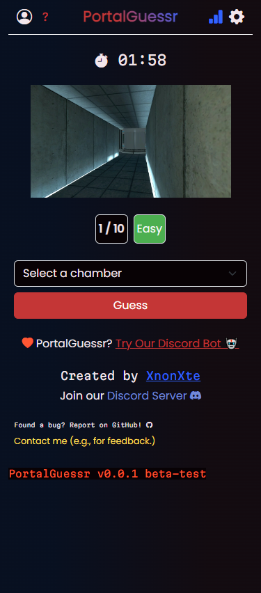

# PortalGuessr Frontend

  

  <a href="#installation">Installation</a>
  |
  <a href="#trello-workspace">Trello Workspace</a>
  |
  <a href="#discord-server">Discord Server</a>

<h4 align="center">PortalGuessr on the web</h4>

Designed to be Mobile friendly from the beginning.

## Installation

- Download the release version if available.
- Run `npm install` to install the required dependencies.
- Run `npm run dev` to start the dev dependencies.
- Run `npm run build` to start the build process.

## Trello Workspace

The official trello workspace for this project: <https://trello.com/b/NgVubCDX/portalguessr-fullstack>

## Discord Server

Join the Discord server to get the latest news about PortalGuessr: https://discord.gg/dDbgtFb2KC
